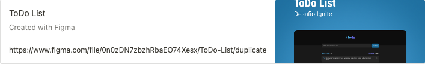

   

  

  
  

## Sobre o desafio 🚀

O Desafio consiste em desenvolver uma aplicação de controle de tarefas no estilo **to-do list**, que contém as seguintes funcionalidades:

-   Adicionar uma nova tarefa
-   Marcar e desmarcar uma tarefa como concluída
-   Remover uma tarefa da listagem
-   Mostrar o progresso de conclusão das tarefas

Para realizar a tarefa precisa relembrar conceitos como:

-   Estados
-   Imutabilidade do estado
-   Listas e chaves no ReactJS
-   Propriedades
-   Componentização

### Acessando o layout do app 🚀

Para ter acesso e duplicar o Layout do desafio basta clicar no link abaixo.

[Link Notion](https://www.notion.so/Desafio-01-Praticando-os-conceitos-do-ReactJS-300c3f5fb4824105aada83d58d2e39f2)

---

Created with 💜 by <a href="https://www.linkedin.com/in/andressa-da-costa">Andressa Da Costa</a> 🚀
